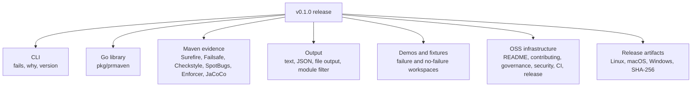
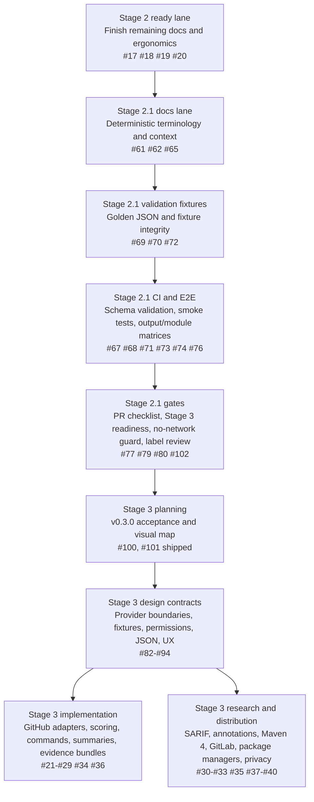
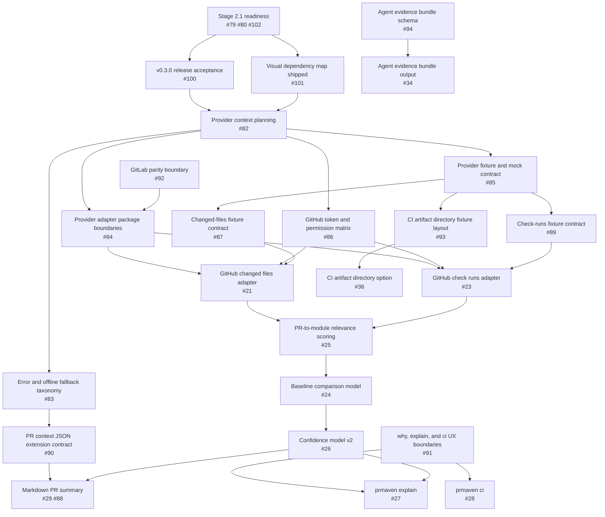
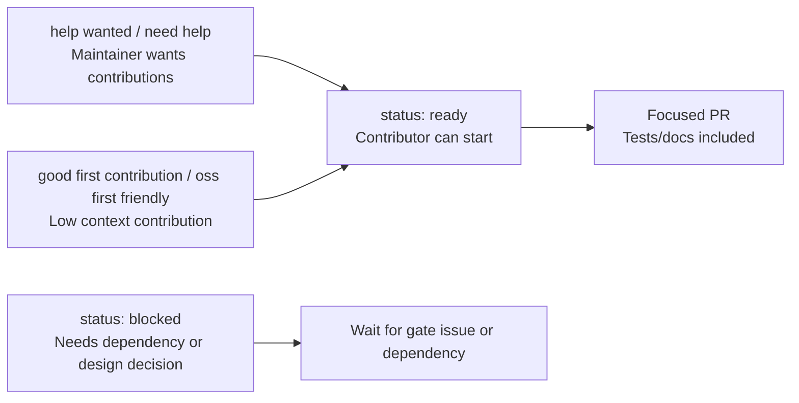
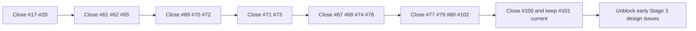

# Project Visual Map

This document gives maintainers and contributors a quick visual view of what is done, what comes next, and how the backlog is organized.

Use it together with [ROADMAP.md](../ROADMAP.md), the [v0.1.0 release snapshot](release-snapshot-v0.1.0.md), and the GitHub issue labels.

## One-Screen Status

```mermaid
flowchart LR
    S1["Stage 1\nv0.1.0 shipped\nLocal Maven report MVP"] --> S2["Stage 2 remaining\nDocs and ergonomics\n#17 #18 #19 #20"]
    S2 --> S21["Stage 2.1\nMVP hardening\nValidation and readiness"]
    S21 --> GATE["Stage 3 readiness gate\n#79 #80 #102"]
    GATE --> S3PLAN["Stage 3 planning\nRelease acceptance and dependency map\n#100, #101 shipped"]
    S3PLAN --> S3DESIGN["Stage 3 design contracts\nProvider boundaries, mocks, fixtures, JSON, UX"]
    S3DESIGN --> S3BUILD["Stage 3 implementation\nOptional PR and CI context layer"]
    S3BUILD --> V03["v0.3.0 target\nPR and CI context release"]
```

Current interpretation:

- Stage 1 is shipped as `v0.1.0`.
- Stage 2 has a small set of ready documentation and CLI ergonomics issues left.
- Stage 2.1 is the hardening lane before broad Stage 3 work.
- Stage 3 is well mapped, but implementation-heavy issues should wait for readiness gates and design contracts.

## What Is Already Done

Important shipped properties:

- Local-first core analyzer.
- No required GitHub, GitLab, CI, AI, or telemetry dependency.
- Provider-agnostic runtime.
- Maven 3.9.x production baseline.
- Maven 4 stays future investigation until the Maven 4 line is production-ready and validated.

## Backlog Lanes

Recommended maintainer order:

1. Finish Stage 2 ready issues.
2. Finish Stage 2.1 documentation and deterministic-context issues.
3. Add fixture and JSON validation.
4. Move stable validation into CI.
5. Complete the Stage 3 readiness gate.
6. Unblock the first Stage 3 design issues.
7. Start implementation only after contracts and mocks exist.

## Stage 3 Dependency Map

Stage 3 rule of thumb:

- Design issues should land before implementation issues.
- Fixture and mock contracts should land before provider adapters.
- Permission and offline fallback docs should land before token-aware behavior.
- JSON and Markdown contracts should land before new public output becomes expected by users.

## Issue Status Guide

When in doubt:

- Prefer `status: ready` issues for immediate work.
- Prefer `good first contribution` or `oss first friendly` issues for new contributors.
- Avoid implementation-heavy Stage 3 issues until the related design contract issues are done.
- Keep every issue tied to a stage label, area label, and status label.

## Fast Path For Maintainers

The shortest practical path from now to healthy Stage 3 execution is:

After that, Stage 3 implementation can begin with much lower ambiguity.

## Source Of Truth

This document is a navigation aid. The source of truth remains:

- [Roadmap](../ROADMAP.md)
- [v0.1.0 release snapshot](release-snapshot-v0.1.0.md)
- [MVP acceptance checklist](mvp-acceptance.md)
- [Implementation status](implementation-status.md)
- [Label guide](labels.md)
- [OSS guardrails](oss-guardrails.md)
- GitHub issue labels and issue bodies

